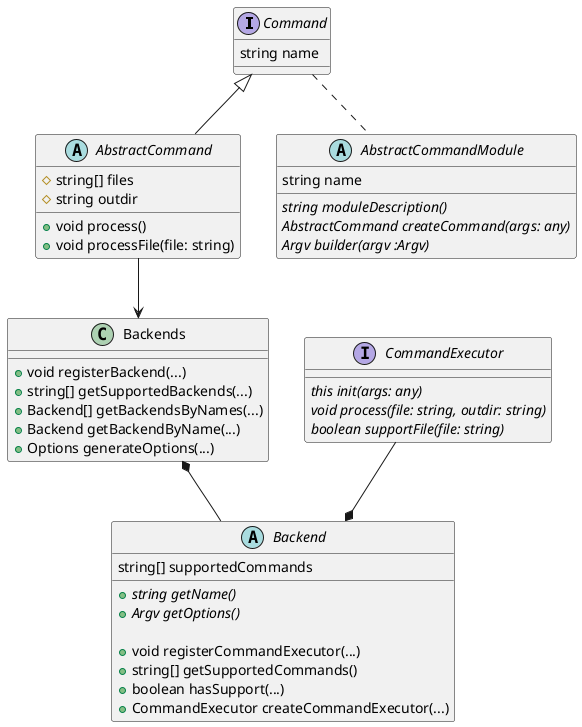

# Software Design

```plantuml
@startuml

Command <|-- AbstractCommand
Command .. AbstractCommandModule

AbstractCommand --> Backends

CommandExecutor --* Backend
Backends *-- Backend

interface Command {
    string name
}

abstract class AbstractCommand {
    # string[] files
    # string outdir

    + void process()
    + void processFile(file: string)
}

abstract class AbstractCommandModule {
    string name

    {abstract} string moduleDescription()
    {abstract} AbstractCommand createCommand(args: any)
    {abstract} Argv builder(argv :Argv)
}

interface CommandExecutor {
    {abstract} this init(args: any)
    {abstract} void process(file: string, outdir: string)
    {abstract} boolean supportFile(file: string)
}

abstract class Backend {
    string[] supportedCommands

    + {abstract} string getName()
    + {abstract} Argv getOptions()

    + void registerCommandExecutor(...)
    + string[] getSupportedCommands()
    + boolean hasSupport(...)
    + CommandExecutor createCommandExecutor(...)
}

class Backends {
    + void registerBackend(...)
    + string[] getSupportedBackends(...)
    + Backend[] getBackendsByNames(...)
    + Backend getBackendByName(...)
    + Options generateOptions(...)
}

@enduml
```